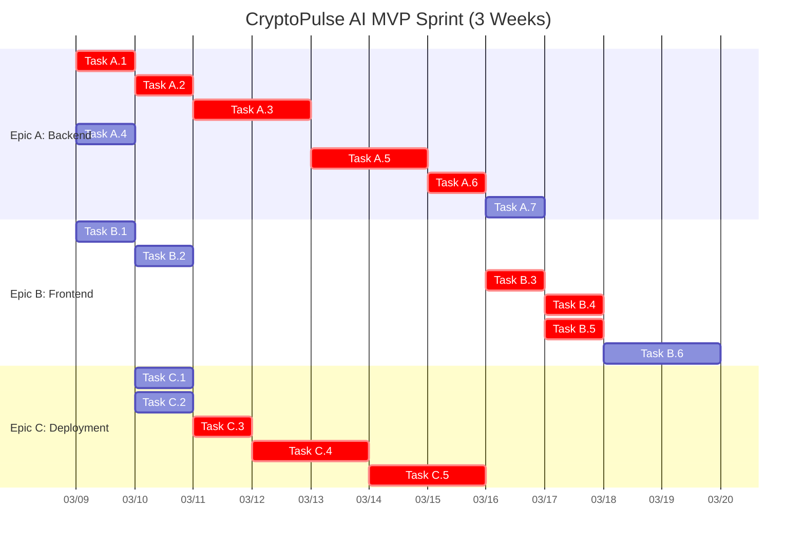

This is the final and most satisfying step: turning our strategic plan into a day-by-day playbook for the team. This detailed breakdown will fit perfectly into your Trello board.

Let's get this done!

---

### **🧩 CryptoPulse AI: MVP Implementation Plan**

**Outcome Goal**
> In 3 weeks, Structured Swing Traders will view a live, transparent market bias signal for BTC, resulting in an average Perceived Confidence Score (PCS) of over 3.5/5 and an 'Alignment Matrix' engagement rate of over 30%. In the same time, our team will learn to build and deploy a complete, end-to-end AI-powered dashboard, from data ingestion with Python to an interactive frontend with Streamlit, using a streamlined agile workflow on our Trello board.

**Team Learning Goals**
*   **Member 1:** Deepen expertise in building and deploying a production-ready Python ML pipeline using FastAPI and Docker.
*   **Member 2:** Master the creation of interactive, data-driven dashboards with Streamlit and Plotly, focusing on effective UI/UX for complex data.

---

### **🧱 Epic A – Core Signal Engine (Backend)**
**Purpose:** To create a reliable, automated backend service that generates the core CryptoPulse AI signal.

**User Stories**
1.  *As a developer, I need to automatically fetch the latest BTC/USD 4H data so that the model always has fresh information.*
2.  *As a developer, I want to expose the complete signal (direction, probability, matrix, risk) via a single API endpoint so that the frontend can easily consume it.*

**Deliverables**
*   A Python script for data ingestion and feature engineering.
*   A trained model file (e.g., `.pkl` or `.joblib`).
*   A documented FastAPI endpoint: `GET /signal/btc`.

| Task (≤ 1 day) | Component / File | Owner | Est. | Acceptance Criteria | Dependencies |
| :--- | :--- | :--- | :--- | :--- | :--- |
| **A.1** Setup data ingestion script | `data/ingestion.py` | M1 | 1d | Script successfully fetches and saves BTC 4H data from an exchange API into a local CSV/Parquet file. | - |
| **A.2** Engineer features for model | `features/build.py` | M1 | 1d | Script loads raw data and outputs a feature set including MAs, RSI, and ATR using `pandas-ta`. | A.1 |
| **A.3** Train baseline classification model | `models/train.py` | M1 | 2d | Script trains a `LightGBM` model and saves the trained artifact. Achieves a baseline accuracy > 55% on a held-out test set. | A.2 |
| **A.4** Create FastAPI app structure | `main.py`, `api/` | M1 | 0.5d | Basic "Hello World" FastAPI server is running locally. | - |
| **A.5** Build signal generation logic | `api/signal_logic.py` | M1 | 1.5d | Function takes latest data, loads the model, and generates the full JSON output (Direction, Probability, Alignment Matrix, Risk). | A.3 |
| **A.6** Implement the `/signal/btc` endpoint | `api/routes.py` | M1 | 1d | `GET /signal/btc` successfully calls the signal logic and returns the correct JSON payload. | A.5 |
| **A.7** Add basic analytics logging | `api/routes.py` | M1 | 1d | When the feedback endpoint is hit, it logs the received score and a timestamp to a file or console. | - |

---

### **🧱 Epic B – Streamlit Signal Dashboard (Frontend)**
**Purpose:** To create a clear, intuitive, and interactive user interface for traders to consume the signal.

**User Stories**
1.  *As a trader (Alex), I want to see the primary signal, the alignment matrix, and the risk level on one screen so I can make a quick, informed decision.*
2.  *As a trader, I want to provide quick feedback on how the signal makes me feel so that I can reflect on my confidence.*

**Deliverables**
*   A multi-component Streamlit application (`app.py`).
*   A UI module for displaying the signal.
*   A feedback component with a backend hook.

| Task (≤ 1 day) | Component / File | Owner | Est. | Acceptance Criteria | Dependencies |
| :--- | :--- | :--- | :--- | :--- | :--- |
| **B.1** Setup initial Streamlit dashboard UI | `app.py`, `ui/` | M2 | 1d | A static dashboard layout exists with placeholders for the signal, matrix, and risk meter. Runs locally. | - |
| **B.2** Build the PCS feedback component | `ui/feedback.py` | M2 | 1d | A 1-5 star or button component is visible. Clicking it triggers a function and displays a "Thank You" message. | - |
| **B.3** Create API client service | `services/api_client.py` | M2 | 1d | A function exists that can call the backend `/signal/btc` endpoint and parse the JSON. Handles connection errors gracefully. | **A.6** |
| **B.4** Integrate API data into dashboard | `app.py` | M2 | 1d | The dashboard calls the API client on load and correctly populates the UI placeholders with live data. | B.3 |
| **B.5** Connect feedback component to backend | `app.py`, `services/api_client.py`| M2 | 1d | Clicking the feedback component now sends the score to a new backend endpoint (`POST /feedback`). | B.2, **A.7** |
| **B.6** Refine UI & add data visualizations | `app.py`, `ui/` | M2 | 2d | Use Plotly to create more polished visualizations for the Alignment Matrix and Risk Meter. Improve overall layout and readability. | B.4 |

---

### **🧱 Epic C – Deployment & Live Testing**
**Purpose:** To make the application accessible to testers and ensure it runs reliably.

**Deliverables**
*   `Dockerfile` for both backend and frontend.
*   A live, publicly accessible URL for the application.

| Task (≤ 1 day) | Component / File | Owner | Est. | Acceptance Criteria | Dependencies |
| :--- | :--- | :--- | :--- | :--- | :--- |
| **C.1** Dockerize the FastAPI backend | `backend/Dockerfile` | M1 | 1d | `docker build` and `docker run` successfully starts the backend server. | A.6 |
| **C.2** Dockerize the Streamlit frontend | `frontend/Dockerfile` | M2 | 1d | `docker build` and `docker run` successfully starts the Streamlit app. | B.1 |
| **C.3** Configure Docker Compose for local dev | `docker-compose.yml` | Both | 1d | `docker-compose up` starts both services, and they can communicate with each other. | C.1, C.2 |
| **C.4** Deploy application to a cloud service | Cloud platform config | Both | 2d | The application is running on a cloud host (e.g., Streamlit Cloud, Heroku, or a small VPS) and is accessible via a URL. | C.3 |
| **C.5** Full end-to-end testing & bug bash | - | Both | 2d | Team performs rigorous testing of the live app, logs bugs, and prioritizes fixes. | C.4 |

---

### **Bonus: Mermaid Gantt Chart Data**

You can copy and paste the code below into **[mermaid.live](https://mermaid.live)** to visualize your 3-week sprint. It's sequenced to respect dependencies and allow for parallel work.

This completes the entire planning process! You now have a comprehensive, strategic, and actionable plan to build your MVP. It's been a pleasure working through this with you. I'm here and ready for any other questions you might have as you start building